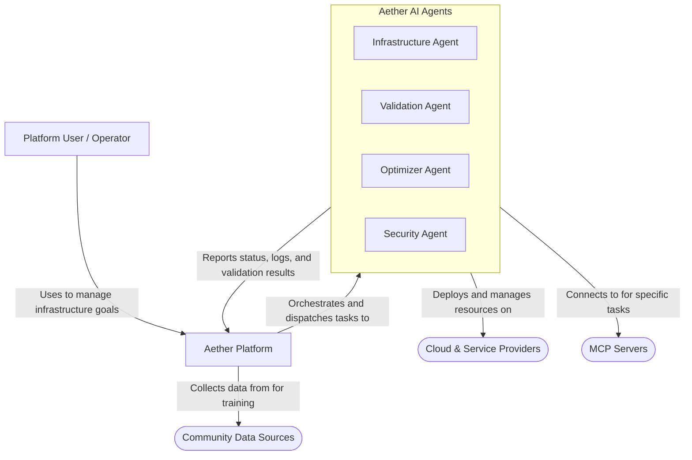

# 🚀 Aether: The Goal-Seeking Infrastructure Platform

Aether is a next-generation control plane that uses a swarm of specialized AI agents to automate the design, migration, and optimization of cloud infrastructure. You declare your goals (latency, cost, compliance), and Aether's agents collaborate to find and maintain the optimal solution across a universe of cloud and service providers.

---

### 🏛️ Architecture Overview

Aether is a distributed system built on a microservices architecture, orchestrated via an event bus. The core components are the Orchestrator, the SGR Engine, the MCP Registry, and a swarm of specialized AI agents.

*For a high-level view, see the System Context Diagram below.*



### ✨ Key Features

-   Goal-Seeking Automation: Define what you want, not how to build it.
-   Specialist AI Agents: A swarm of agents for infrastructure conversion, validation, security, and optimization.
-   Schema-Guided Reasoning (SGR): Ensures agent outputs are structured, reliable, and correct.
-   Collaborative Validation Network: Agents perform peer review on infrastructure changes for unparalleled quality assurance.
-   Dynamic MCP Registry: Automatically discovers and connects to the tools and provider APIs needed for any given task.
-   Continuous Learning: The platform learns from every successful and failed migration to continuously improve its agents.

---

### 🚀 Getting Started

This project is set up as a monorepo using npm workspaces.

#### Prerequisites

-   [Node.js](https://nodejs.org/) (v18+)
-   [Docker](https://www.docker.com/) and Docker Compose
-   [Go](https://go.dev/) (v1.19+)

#### Initialization and Installation

1.  Initialize a Git Repository:
    ```bash
    git init
    git add .
    git commit -m "Initial commit: Aether platform structure"
    # Follow instructions on GitHub to create a new repository and push
    # git remote add origin <your-repo-url>
    # git branch -M main
    # git push -u origin main
    ```

2.  Install Dependencies:
    From the root `aether-platform` directory, run:
    ```bash
    npm install
    ```
    This will install dependencies for all packages (`chrome-extension`, `web-console`, etc.) defined in the root `package.json`.

#### Running in Development Mode

1.  Start Backend Services:
    This command will start all the necessary backing services (Postgres, NATS, etc.) defined in `docker-compose.yml`.
    ```bash
    docker-compose up -d
    ```

2.  Start the Web Console:
    ```bash
    npm run dev --workspace=web-console
    ```
    This will start the frontend development server, typically on `http://localhost:3000`.

---

### 🧩 Chrome Extension

The Aether platform includes a companion Chrome Extension for interacting with cloud provider consoles directly.

#### Building the Extension

To create a production-ready build of the extension:
```bash
npm run build --workspace=chrome-extension
```
This will generate a `dist` folder inside `packages/chrome-extension`.

#### Loading the Extension in Chrome

1.  Open Google Chrome and navigate to `chrome://extensions`.
2.  Turn on the "Developer mode" toggle in the top-right corner.
3.  Click the "Load unpacked" button.
4.  Select the `packages/chrome-extension/dist` folder that was created by the build command.
5.  The Aether extension icon should now appear in your browser's toolbar.

---

### 🏗️ Architectural Principles

This project is built following modern cloud-native best practices:

-   12-Factor App Methodology: Ensures the platform is scalable, resilient, and maintainable.
-   Non-Breaking Changes: We use API versioning, the expand-contract pattern, and feature flags to evolve the platform without downtime.
-   Automated Quality Monitoring: Deep observability is built-in using metrics, logs, and traces to proactively monitor system health.
